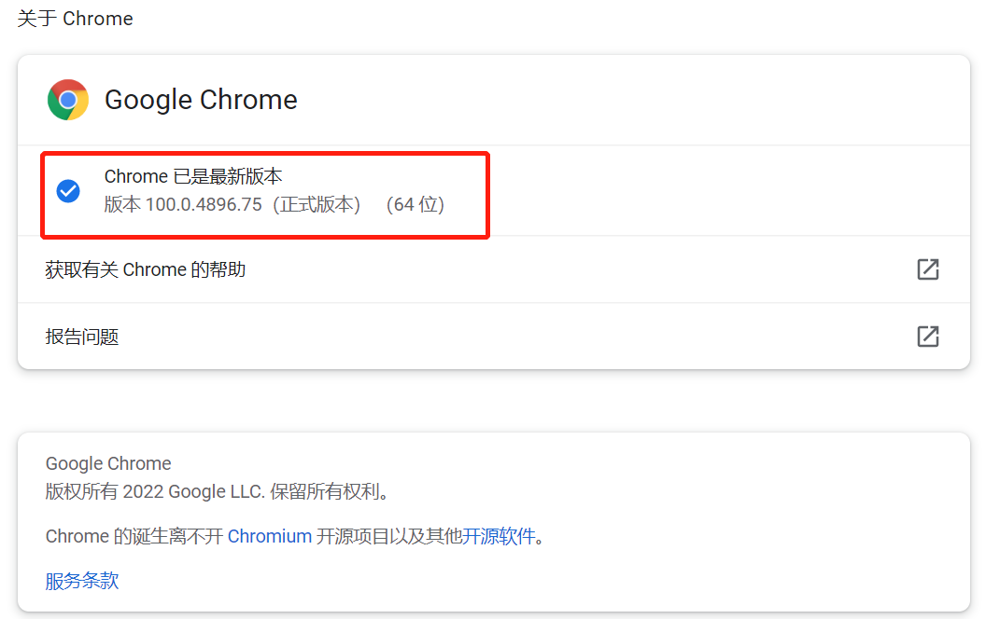

# hello-selenium

## 是什么

 Selenium是一系列基于Web的自动化工具，提供一套测试函数，用于支持Web自动化测试。函数非常灵活，能够完成界面元素定位、窗口跳转、结果比较。具有如下特点：

- 多浏览器支持
  - 如IE、Firefox、Safari、Chrome、Android手机浏览器等。
- 支持多语言
  - 如Java、C#、Python、Ruby、PHP等。
- 支持多操作系统
  - 如Windows、Linux、IOS、Android等。
- 开源免费
  - 官网：http://www.seleniumhg.org/

Selenium框架由多个工具组成，包括：Selenium IDE，Selenium RC，**Selenium WebDriver**和SeleniumRC。

## 怎么用

### 下载 chromedriver

1. 下载地址 [chromedriver-官网-新](https://sites.google.com/chromium.org/driver/)
2. 注意驱动版本应该和本地chrome版本一致
   * 本地chrome版本查询方式
     * chrome菜单栏 ---> 帮助 ---> 关于 Chrome
     * 

#### 下载地址

### 搭建maven普通项目

## 参考

* [selenium.dev 官网](https://www.selenium.dev/documentation)
* [chromedriver-官网-新](https://sites.google.com/chromium.org/driver/)
* [chromedriver 仓库](https://chromedriver.storage.googleapis.com/index.html)
* [selenium 使用教程详解-java版本](https://www.cnblogs.com/tester-ggf/p/12602211.html)

