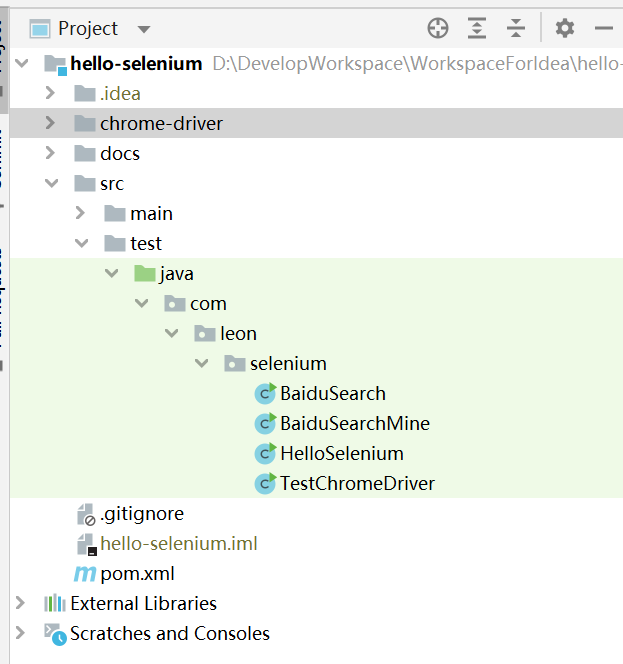
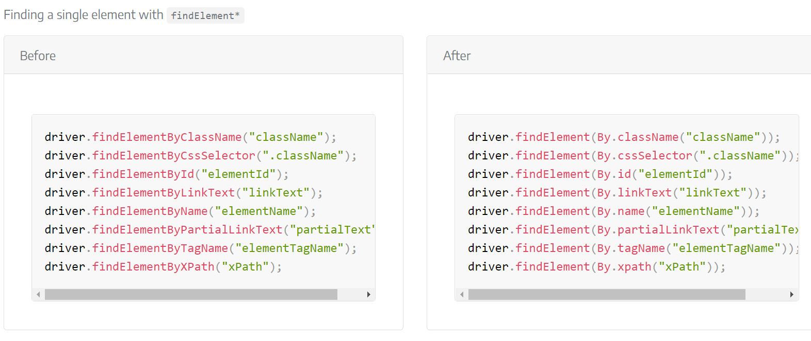
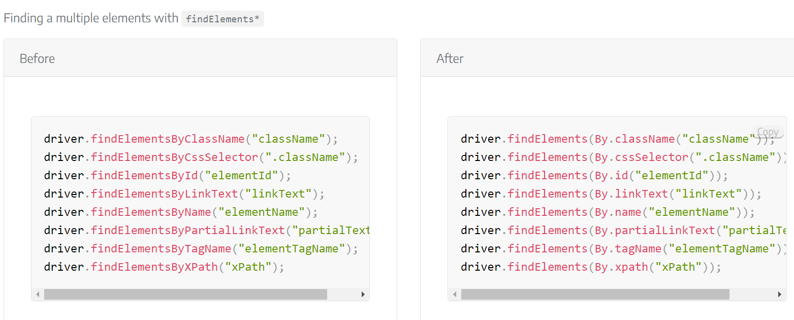
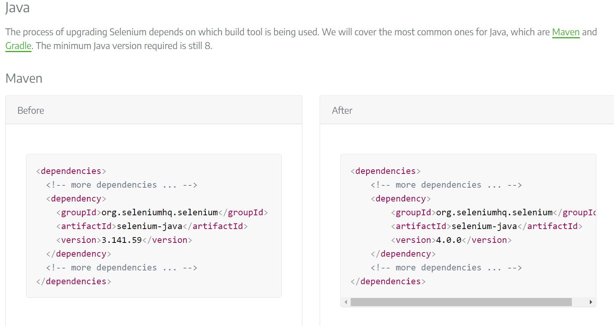

# hello-selenium

## 是什么

 Selenium是一系列基于Web的自动化工具，提供一套测试函数，用于支持Web自动化测试。函数非常灵活，能够完成界面元素定位、窗口跳转、结果比较。具有如下特点：

- 多浏览器支持
  - 如IE、Firefox、Safari、Chrome、Android手机浏览器等。
- 支持多语言
  - 如Java、C#、Python、Ruby、PHP等。
- 支持多操作系统
  - 如Windows、Linux、IOS、Android等。
- 开源免费
  - 官网：http://www.seleniumhg.org/

Selenium框架由多个工具组成，包括：Selenium IDE，Selenium RC，**Selenium WebDriver**和SeleniumRC。


## 怎么用

### 下载 chromedriver

1. 下载地址 [chromedriver-官网-新](https://sites.google.com/chromium.org/driver/)
2. 注意驱动版本应该和本地chrome版本一致
   * 本地chrome版本查询方式
     * chrome菜单栏 ---> 帮助 ---> 关于 Chrome
     * 


### 搭建maven普通项目

**refer to: https://github.com/OceanLeonAI/hello-selenium**

1. pom.xml 定义

   ```xml
   <?xml version="1.0" encoding="UTF-8"?>
   <project xmlns="http://maven.apache.org/POM/4.0.0" xmlns:xsi="http://www.w3.org/2001/XMLSchema-instance"
            xsi:schemaLocation="http://maven.apache.org/POM/4.0.0 https://maven.apache.org/xsd/maven-4.0.0.xsd">
       <modelVersion>4.0.0</modelVersion>
   
       <groupId>com.leon</groupId>
       <artifactId>hello-selenium</artifactId>
       <version>0.0.1-SNAPSHOT</version>
       <name>hello-selenium</name>
       <description>hello-selenium</description>
   
       <properties>
           <java.version>1.8</java.version>
           <selenium.version>3.141.59</selenium.version> <!--  -->
           <webdrivermanager.version>5.1.0</webdrivermanager.version>
       </properties>
   
       <dependencyManagement>
           <dependencies>
               <dependency>
                   <groupId>org.seleniumhq.selenium</groupId>
                   <artifactId>selenium-java</artifactId>
                   <version>${selenium.version}</version>
               </dependency>
               <dependency>
                   <groupId>io.github.bonigarcia</groupId>
                   <artifactId>webdrivermanager</artifactId>
                   <version>${webdrivermanager.version}</version>
                   <scope>test</scope>
               </dependency>
               <!-- https://www.selenium.dev/zh-cn/documentation/webdriver/getting_started/install_library/ -->
               <dependency>
                   <groupId>org.seleniumhq.selenium</groupId>
                   <artifactId>selenium-java</artifactId>
                   <version>${selenium.version}</version>
               </dependency>
               <dependency>
                   <groupId>org.seleniumhq.selenium</groupId>
                   <artifactId>selenium-chrome-driver</artifactId>
                   <version>${selenium.version}</version>
               </dependency>
           </dependencies>
       </dependencyManagement>
   
       <dependencies>
           <!-- https://www.selenium.dev/zh-cn/documentation/webdriver/getting_started/install_library/ -->
           <dependency>
               <groupId>org.seleniumhq.selenium</groupId>
               <artifactId>selenium-java</artifactId>
           </dependency>
       </dependencies>
   
   </project>
   ```

   

2. 项目结构

   

3. 示例代码

   ```java
   package com.leon.selenium;
   
   import org.openqa.selenium.By;
   import org.openqa.selenium.WebDriver;
   import org.openqa.selenium.chrome.ChromeDriver;
   
   /**
    * @Description: 通过selenium操作浏览器打开百度进行搜索
    */
   public class BaiduSearchMine {
   
       // 系统分隔符
       public static final String SYSTEM_SEPARATOR = System.getProperty("file.separator");
   
       // 驱动名称
       public static final String DRIVER_NAME = "chromedriver.exe";
   
       // 获取当前项目的绝对路径
       public static final String PROJECT_PATH = System.getProperty("user.dir");
   
       // 驱动路径
       // D:\DevelopWorkspace\WorkspaceForIdea\hello-selenium\chrome-driver\chromedriver.exe
       public static final String DRIVER_PATH = PROJECT_PATH + SYSTEM_SEPARATOR + "chrome-driver" + SYSTEM_SEPARATOR + DRIVER_NAME;
   
       public static void main(String[] args) {
   
           System.out.println("DRIVER_PATH ---> " + DRIVER_PATH);
   
           // 设置系统环境变量
           System.setProperty("webdriver.chrome.driver", DRIVER_PATH);
   
           // 1.创建webdriver驱动
           WebDriver driver = new ChromeDriver();
           // 2.打开百度首页
           driver.get("https://www.baidu.com");
           // 3.获取输入框，输入selenium
           driver.findElement(By.id("kw")).sendKeys("selenium");
           // 4.获取“百度一下”按钮，进行搜索
           driver.findElement(By.id("su")).click();
           // 5.退出浏览器
           driver.quit();
       }
   }
   ```


### 特性

#### 元素定位

**selenium 提供了8种的定位方式：**

- id
- name
- class name
- tag name
- link text
- partial link text
- xpath
- css selector

这8种定位方式在java selenium 中对应的方法为：

| 方法                              | 描述                                       | 参数            | 示例                                       |
| --------------------------------- | ------------------------------------------ | --------------- | ------------------------------------------ |
| findElement(By.id())              | 通过元素的 id 属性值来定位元素             | 对应的id属性值  | findElement(By.id("kw"))                   |
| findElement(By.name())            | 通过元素的 name 属性值来定位元素           | 对应的name值    | findElement(By.name("user"))               |
| findElement(By.className())       | 通过元素的 class 名来定位元素              | 对应的class类名 | findElement(By.className("passworld"))     |
| findElement(By.tagName())         | 通过元素的 tag 标签名来定位元素            | 对应的标签名    | findElement(By.tagName("input"))           |
| findElement(By.linkText())        | 通过元素标签对之间的文本信息来定位元素     | 文本内容        | findElement(By.linkText("登录"))           |
| findElement(By.partialLinkText()) | 通过元素标签对之间的部分文本信息来定位元素 | 部分文本内容    | findElement(By.partialLinkText("百度"))    |
| findElement(By.xpath())           | 通过xpath语法来定位元素                    | xpath表达式     | findElement(By.xpath("//input[@id='kw']")) |
| findElement(By.cssSelector())     | 通过css选择器来定位元素                    | css元素选择器   | findElement(By.cssSelector("#kw"))         |

同时这8种方法都对应有着返回复数元素的方法，分别在调用的方法findElements(By.id()) 加上一个s：

- findElements(By.id())
- findElements(By.name())
- findElements(By.className())
- findElements(By.tagName())
- findElements(By.linkText())
- findElements(By.partialLinkText())
- findElements(By.xpath())
- findElements(By.cssSelector())

#### 常用api

##### WebDriver

| 方法               | 描述                        |
| ------------------ | --------------------------- |
| get(String url）   | 访问目标 url 地址，打开网页 |
| getCurrentUrl()    | 获取当前页面 url 地址       |
| getTitle()         | 获取页面标题                |
| getPageSource()    | 获取页面源代码              |
| close()            | 关闭浏览器当前打开的窗口    |
| quit()             | 关闭浏览器所有的窗口        |
| findElement(by)    | 查找单个元素                |
| findElements(by)   | 查到元素列表，返回一个集合  |
| getWindowHandle()  | 获取当前窗口句柄            |
| getWindowHandles() | 获取所有窗口的句柄          |

##### WebElement

通过 WebElement 实现与网站页面上元素的交互，这些元素包含文本框、文本域、按钮、单选框、div等，WebElement提供了一系列的方法对这些元素进行操作：

| 方法                        | 描述                                       |
| --------------------------- | ------------------------------------------ |
| click()                     | 对元素进行点击                             |
| clear()                     | 清空内容（如文本框内容）                   |
| sendKeys(...)               | 写入内容与模拟按键操作                     |
| isDisplayed()               | 元素是否可见（true:可见，false：不可见）   |
| isEnabled()                 | 元素是否启用                               |
| isSelected()                | 元素是否已选择                             |
| getTagName()                | 获取元素标签名                             |
| getAttribute(attributeName) | 获取元素对应的属性值                       |
| getText()                   | 获取元素文本值（元素可见状态下才能获取到） |
| submit()                    | 表单提交                                   |

### 注意高版本api变化

**refer to: https://www.selenium.dev/documentation/webdriver/getting_started/upgrade_to_selenium_4/**

####  findElement* 



####  findElements* 



#### maven dependency




## 参考

* [selenium.dev 官网](https://www.selenium.dev/documentation)
* [chromedriver-官网-新](https://sites.google.com/chromium.org/driver/)
* [chromedriver 仓库](https://chromedriver.storage.googleapis.com/index.html)
* [selenium 使用教程详解-java版本](https://www.cnblogs.com/tester-ggf/p/12602211.html)

